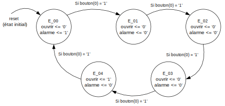

-----------------------------------------------------------------------
<table>
<tr>
<td></td>
<td><h2>INF3500 - Conception et réalisation de systèmes numériques
  Hiver 2022
  Laboratoire #3
  Circuits séquentiels et chemins des données
</h2></td>
</tr>
</table>

----------------------------------------------------------------------------------------------

# Le cadenas à boutons

----------------------------------------------------------------------------------------------

À la fin de ce laboratoire, vous devrez être capable de :

- Concevoir un circuit séquentiel à partir d’une spécification. Donner un diagramme d’état, le code VHDL, le schéma du circuit et son implémentation résultante sur un FPGA. (B5)
    - Utiliser une horloge et un signal de réinitialisation
    - Utiliser des registres et des compteurs
    - Utiliser une machine à états
- Composer un banc d’essai pour stimuler un modèle VHDL d’un circuit séquentiel. Donner le chronogramme résultant de l’exécution d’un banc d’essai. (B4,B5)
    - Générer un signal d'horloge et un signal de réinitialisation
    - Générer des stimuli pour un circuit séquentiel
    - Calculer les sorties correspondantes aux stimuli
    - Réconcilier les problèmes de synchronisation
    - Utiliser des énoncés `assert` ou des conditions pour vérifier le module
- Implémenter un circuit séquentiel sur un FPGA et en vérifier le fonctionnement correct
    - Utiliser des interfaces comme des boutons et des affichages à LED
    - Constater et corriger les phénomènes de rebond des boutons et commutateurs

Ce laboratoire s'appuie sur le matériel suivant :
1. Les concepts couverts dans les laboratoires #1 et #2.
2. La matière des cours de la semaines 4 (Modélisation et vérification de circuits combinatoires) et 5 (Conception de chemins des données - surtout les diapositives 0502).

## Partie 0 : une machine à états de base

### Préparatifs

- Créez un répertoire `inf3500\labo-3` dans lequel vous mettrez tous les fichiers de ce laboratoire.
- Importez tous les fichiers du laboratoire à partir de l'entrepôt Git.
- Si vous utilisez Active-HDL :
    - Créez un espace de travail (workspace) et créez un projet (design).
    - Ajoutez les fichiers dans votre projet.
    - Compilez tous les fichiers.
    
Les fichiers suivants sont  fournis pour aider à contrôler les interfaces de la carte et faire l'implémentation dans le FPGA. Ne les modifiez pas.
- [utilitaires_inf3500_pkg.vhd](sources/utilitaires_inf3500_pkg.vhd) : pour regrouper un ensemble de fonctions utiles pour les laboratoires du cours;
- [generateur_horloge_precis.vhd](sources/generateur_horloge_precis.vhd) : pour générer une horloge à une fréquence désirée à partir de l'horloge de la carte;
- [monopulseur.vhd](sources/monopulseur.vhd) : pour synchroniser les actions des humains avec l'horloge du système;
- [top_labo_3.vhd](sources/top_labo_3.vhd) : pour regrouper tous les fichiers lors de l'implémentation;
- xdc/basys_3_top.xdc, xdc/nexys_a7_50t_top.xdc et xdc/nexys_a7_100t_top.xdc : pour établir des liens entre des identificateurs et des pattes du FPGA; et,
- [labo_3_synth_impl.tcl](synthese-implementation/labo_3_synth_impl.tcl) : pour regrouper les commandes à utiliser pour faire l'implémentation.

### La machine à états et son code VHDL

Une machine à états de base vous est fournie dans le fichier [cadenas_labo_3.vhd](sources/cadenas_labo_3.vhd). La machine à états de base correspond au diagramme d'états suivant.

La machine a cinq états, E_00 à E_04 inclusivement. À chaque coup d'horloge, la machine avance d'un état si le bouton(0) a une valeur de '1'. Les sorties sont indiquées dans les états.

### Simulation    

Une ébauche de banc d'essai se trouve dans le fichier [cadenas_labo_3_tb.vhd](sources/cadenas_labo_3_tb.vhd). Faites la simulation de la machine à états de base à l'aide de ce banc d'essai.
- Choisissez le module `cadenas_labo_3_tb` comme `Top-Level`.
- Initialisez la simulation.
- Créez un chronogramme et glissez-y l'unité sous test `UUT`.
- Lancez la simulation, observez le chronogramme et observez les messages dans la console.
- Constatez qu'une valeur de '1' au bouton(0) résulte en une transition d'états lors de la prochaine transition positive de l'horloge.
- Constatez que les sorties `ouvrir` et `alarme` varient en fonction de l'état actuel de la machine.

Si vous utilisez un autre environnement, suivez des étapes similaires pour lancer la simulation et observer les résultats.

### Implémentation et programmation de la carte

Suivez les étapes suivantes pour faire la synthèse et l'implémentation du code sur votre carte :

1. Lancez une fenêtre d'invite de commande (`cmd` sous Windows) et naviguez au répertoire `\inf350\labo-3\synthese-implementation\`.
2. De ce répertoire, lancez Vivado en mode script avec la commande 
`{repertoire-d-installation-d-Vivado}\bin\vivado -mode tcl` où {repertoire-d-installation-d-Vivado} est probablement C:\Xilinx\Vivado\2021.1 si votre système d'exploitation est Windows.
3. Dans la fenêtre, à l'invite de commande `Vivado%`, entrez les commandes contenues dans le fichier [labo_3_synth_impl.tcl](synthese-implementation/labo_3_synth_impl.tcl). Si votre carte n'est pas une Basys 3, vous devrez commenter certaines lignes et en dé-commenter d'autres qui correspondent à votre carte.

Observez le fonctionnement correct du système sur la carte.

Inspectez le contenu du fichier [top_labo_3.vhd](sources/top_labo_3.vhd) : 
- Le port `reset` est relié au bouton du centre;
- Le port `boutons(3 downto 0)` est relié dans l'ordre aux boutons du bas, de gauche, d'en haut et de droite.
- Les boutons sont également reliés à des LED, directement et aussi par l'entremise du module de stabilisation et de synchronisation du fichier [monopulseur.vhd](sources/monopulseur.vhd). Observez que quand vous appuyez sur un bouton et le gardez pressé, une LED reste allumée et une autre ne reçoit qu'une seule courte impulsion.
- Les ports `alarme` et `ouvrir` sont reliés aux LED(1:0).
- L'affichage quadruple à 7 segments affiche les caractères placés sur le port `message`.

## Partie 1 : Conception du cadenas

### Spécifications de base

Faites la conception d'un cadenas numérique à boutons rencontrant les spécifications suivantes :
- La combinaison est composée d'une suite de boutons appuyés les uns après les autres dans une séquence déterminée.
- La combinaison de base doit être : {bouton-droite, bouton-haut, bouton-gauche, bouton-bas, bouton-droite}.
- Quand la combinaison est entrée correctement, le port `ouvrir` doit prendre la valeur '1', ce qui fait allumer la LED correspondante.
- l'affichage doit indiquer "dbrr" quand le cadenas est débarré.
- Le cadenas se verrouille dès qu'une combinaison incorrecte est entrée.
- Pour verrouiller le cadenas après qu'il ait été déverrouillé, on le réinitialise à l'aide du bouton du centre relié au port `reset`.

Modifiez le fichier [cadenas_labo_3.vhd](sources/cadenas_labo_3.vhd) en conséquence. **Ne modifiez pas le nom du fichier, le nom de l'entité, la liste et le nom des ports, la liste et le nom des `generics`, ni le nom de l'architecture.**

### Simulation, synthèse implémentation

Simulez complètement votre code. Faites en la synthèse et l'implémentation sur votre carte. Vérifiez-en le fonctionnement.

### À remettre pour la partie 1

- Une brève explication de vos modifications dans le fichier [rapport.md](rapport.md);
- Un seul fichier [cadenas_labo_3.vhd](sources/cadenas_labo_3.vhd) modifié pour toute la partie 1;
- Un diagramme d'états modifié en format .png ou .svg. Vous pouvez modifier directement [le diagramme fourni avec diagrams.net](https://app.diagrams.net/) ou bien soumettre un dessin fait à la main, au propre, ou par tout autre moyen.
- Votre fichier de configuration final : [labo_3.bit](/synthese-implementation/labo_3.bit).

## Partie 2 : Bonification du banc d'essai

Modifiez le banc d'essai dans le fichier [cadenas_labo_3_tb.vhd](sources/cadenas_labo_3_tb.vhd) pour vérifier complètement votre module.

### À remettre pour la partie 2
- Une brève explication des vérifications de votre banc d'essai dans le fichier [rapport.md](rapport.md);
- Votre fichier [cadenas_labo_3_tb.vhd](sources/cadenas_labo_3_tb.vhd) modifié;

## Partie 3 : Spécification avancée

Ajoutez les spécifications suivantes à votre cadenas :
- Quand le cadenas est débarré, on peut modifier la combinaison avec les étapes suivantes :
    - Appuyer simultanément sur les boutons de droite et de gauche.
    - L'affichage doit alors indiquer "modc" pour indiquer qu'on modifie maintenant la combinaison.
    - Appuyer sur une séquence de cinq bouton (excluant le bouton du centre, relié au `reset`) afin de l'enregistrer comme nouvelle séquence, après quoi le cadenas se verrouille en retournant à son état initial.
- Appuyer sur le bouton du centre `reset` a pour effet de réinitialiser la combinaison du cadenas à la séquence de la partie 1.
- Quand le cadenas est débarré, appuyer simultanément sur les boutons du haut et du bas verrouille le cadenas sans réinitialiser la combinaison.

Modifiez votre banc d'essai pour vérifier les nouvelles fonctionnalités.

Implémentez votre cadenas modifié sur la carte.

### À remettre pour la partie 3

- Une brève explication de vos modifications dans le fichier [rapport.md](rapport.md);
- Un seul fichier [cadenas_labo_3.vhd](sources/cadenas_labo_3.vhd) modifié pour les parties 1 et 3 mais avec des commentaires montrant clairement à quelle partie le code correspond;
- Un seul diagramme d'états modifié pour les partie 1 et 3, en format .png ou .svg. Vous pouvez modifier directement [le diagramme fourni avec diagrams.net](https://app.diagrams.net/) ou bien soumettre un dessin fait à la main, au propre, ou par tout autre moyen.
- Votre banc d'essai final qui vérifie toutes les spécifications des parties 1 et 3, dans un seul fichier [cadenas_labo_3_tb.vhd](sources/cadenas_labo_3_tb.vhd) modifié;
- Votre fichier de configuration final : [labo_3.bit](/synthese-implementation/labo_3.bit).

## Partie 4: Bonus

**Mise en garde**. *Compléter correctement les parties 1 et 2 peut donner une note de 17 / 20 (85%), ce qui peut normalement être interprété comme un A. La partie bonus demande du travail supplémentaire qui sort normalement des attentes du cours. Il n'est pas nécessaire de la compléter pour réussir le cours ni pour obtenir une bonne note. Il n'est pas recommandé de s'y attaquer si vous éprouvez des difficultés dans un autre cours. La partie bonus propose un défi supplémentaire pour les personnes qui souhaitent s'investir davantage dans le cours INF3500 en toute connaissance de cause.*

** Pas clair comment les boni s'agencent entre eux **

### 3a. Combinaison obfusquée

Dans les spécifications des parties, une utilisatrice astucieuse pourrait deviner la combinaison en essayant successivement tous les boutons en observant la séquence des états. Ajoutez un mode de fonctionnement obfusqué activé par une valeur de "01" sur l'entrée `mode` (le fonctionnement normal des parties 1 et 3 doit se faire quand le port `mode` a les autres valeurs.

En mode obfusqué :
- Il faut emmagasiner un code composé d'une séquence de 5 boutons avant de véfifier si la combinaison correcte a été entrée.
- L'affichage doit indiquer "br_1", "br_2", "br_3", "br_4" et "br_5" pour indiquer à l'utilisateur l'indice du bouton dans la séquence en cours.
- Si la séquence est incorrecte, l'affichage doit alors indiquée "barr" pour (barré).
- Si la séquence correcte est entrée, l'affichage doit indiquer "dbrr" pour (débarré).

Expliquez tous vos changements dans votre rapport.

### 3b. Ajout d'une alarme pour code incorrect

Dès qu'une erreur est faite dans la combinaison, le port `alarme` doit prendre la valeur '1', ce qui fait allumer la LED correspondante. Dans ce cas, la seule façon de reprendre l'opération du cadenas est d'appuyer sur le bouton du centre relié à `reset`.

Expliquez tous vos changements dans votre rapport.

## Remise

La remise se fait directement sur votre entrepôt Git. Faites un 'push' régulier de vos modifications, et faites un 'push' final avant la date limite de la remise. Respectez l'arborescence de fichiers originale. Consultez le barème de correction pour la liste des fichiers à remettre.

**Directives spéciales :**
- Ne modifiez pas les noms des fichiers, les noms des entités, les listes des `generics`, les listes des ports ni les noms des architectures.
- Remettez du code de très bonne qualité, lisible et bien aligné, bien commenté.
- Indiquez clairement la source de tout code que vous réutilisez ou duquel vous vous êtes inspiré/e.
- Modifiez et complétez le fichier [rapport.md](rapport.md), entre autres pour spécifier quelle carte vous utilisez.

## Barème de correction

Le barème de correction est progressif. Il est relativement facile d'obtenir une note de passage (> 10) au laboratoire et il faut mettre du travail pour obtenir l'équivalent d'un A (17/20). Obtenir une note plus élevée (jusqu'à 20/20) nécessite plus de travail que ce qui est normalement demandé dans le cadre du cours et plus que les 9 heures que vous devez normalement passer par semaine sur ce cours.

Critères | Points
-------- | ------
Partie 1 : Spécification de base | 4
Partie 2 : Banc d'essai de base | 3
Partie 3 : Spécifications avancées | 8
Qualité, lisibilité et élégance du code : alignement, choix des identificateurs, qualité et pertinence des commentaires, respect des consignes de remise incluant les noms des fichiers, orthographe, etc. | 2
**Pleine réussite du labo** | **17**
Bonus partie 3a. | 1
Bonus partie 3b. | 2
**Maximum possible sur 20 points** | **20**

## Références pour creuser plus loin

Les liens suivants ont été vérifiés en septembre 2021.

- Aldec Active-HDL Manual : accessible en faisant F1 dans l'application, et accessible [à partir du site de Aldec](https://www.aldec.com/en/support/resources/documentation/manuals/).
- Tous les manuels de Xilinx :  <https://www.xilinx.com/products/design-tools/vivado/vivado-ml.html#documentation>
- Vivado Design Suite Tcl Command Reference Guide : <https://www.xilinx.com/content/dam/xilinx/support/documentation/sw_manuals/xilinx2021_1/ug835-vivado-tcl-commands.pdf>
- Vivado Design Suite User Guide - Design Flows Overview : <https://www.xilinx.com/support/documentation/sw_manuals/xilinx2020_2/ug892-vivado-design-flows-overview.pdf>
- Vivado Design Suite User Guide - Synthesis : <https://www.xilinx.com/support/documentation/sw_manuals/xilinx2020_2/ug901-vivado-synthesis.pdf>
- Vivado Design Suite User Guide - Implementation : <https://www.xilinx.com/support/documentation/sw_manuals/xilinx2020_2/ug904-vivado-implementation.pdf>
